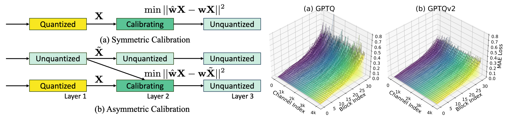

<h1 align="center">
    <p> GPTQv2: Efficient Finetuning-Free Quantization with Asymmetric Calibration <br> [ICML2025]</p>
</h1>

<h1 align="center"> 
    
</h1>

The official pytorch implementation of GPTQv2. 

Unlike the previous GPTQ method, which independently calibrates each layer, we always match the quantized layer’s
output to the exact output in the full-precision model, resulting in a scheme that we call asymmetric calibration. Such a scheme can effectively reduce the quantization error accumulated in previous layers. We analyze this problem using optimal brain compression to derive a close-formed solution. The new solution explicitly minimizes the quantization error as well as the accumulated asymmetry error. Furthermore, we utilize various techniques to parallelize the solution calculation, including channel parallelization, neuron decomposition, and Cholesky reformulation for matrix fusion. As a result, GPTQv2 is easy to
implement, simply using 20 more lines of code than GPTQ but improving its performance under low-bit quantization.


## Code Structure

We provide several directories to reproduce the paper results. 

1. fake_quant for reproducing QuaRot+GPTQ/GPTQv2 
2. spinquant for reproducing SpinQuant+GPTQ/GPTQv2
3. vit_quant for reproducing vision transformer quantization results
4. GPTQModel, a forked version of GPTQModel to support GPTQv2 to deploy model

Note: We recommend use separate envrionments for different experiments to ensure results are matched. 

## Citations

If you find DoRA useful, please consider giving a star and citation:
```bibtex
@article{liu2024dora,
  title={DoRA: Weight-Decomposed Low-Rank Adaptation},
  author={Liu, Shih-Yang and Wang, Chien-Yi and Yin, Hongxu and Molchanov, Pavlo and Wang, Yu-Chiang Frank and Cheng, Kwang-Ting and Chen, Min-Hung},
  journal={arXiv preprint arXiv:2402.09353},
  year={2024}
}
```